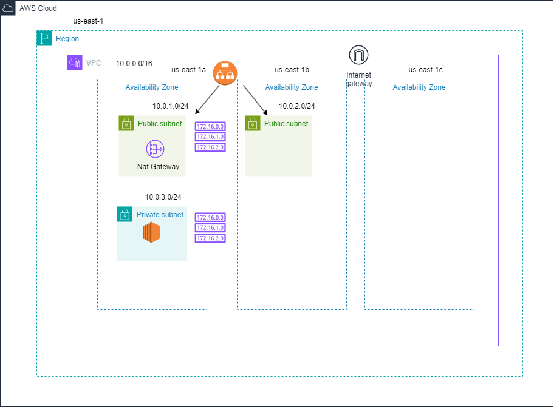

## Awesome documentation for Setup 7 - Deploying an Nginx Web Server in a server(Ubuntu AMI) within a Private Subnet 

# Instructions for Setup 7

`Set Up 1`

`Create a single Ubuntu server in the private subnet`

`Install nginx on the server`

`Create a load balancer in two public subnets and connect it to the private server`

`Connect to the webserver via the loadbalancer url`

`Draw the architecture diagram of this set up`

`What is Setup 1`

`Create a VPC`

`Create an IGW`

`Create Route table`

`Create One Public and One Private Subnets.`

`Draw the architecture diagram of this set up`

`This repository content contains all the code necessary to deploy the following resources:` 

`1) VPC Create`

`2) IGW (Internet Gateway)` 

`3) Public Route table`

`4) Private Route table` 

`5) Two Public Subnets` 

`6) One Private Subnets` 

`7) Create a single Ubuntu server in the private subnet`

`8) Install nginx`

`9) A load balancer in the public subnet`
